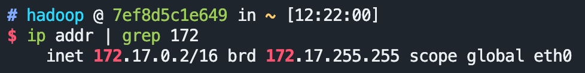
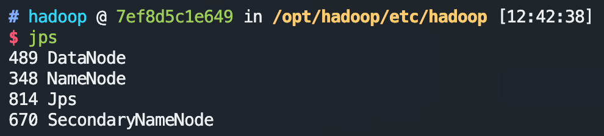
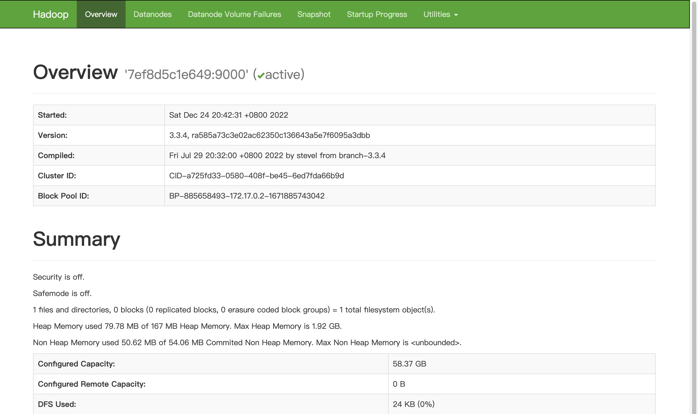
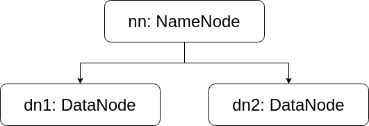
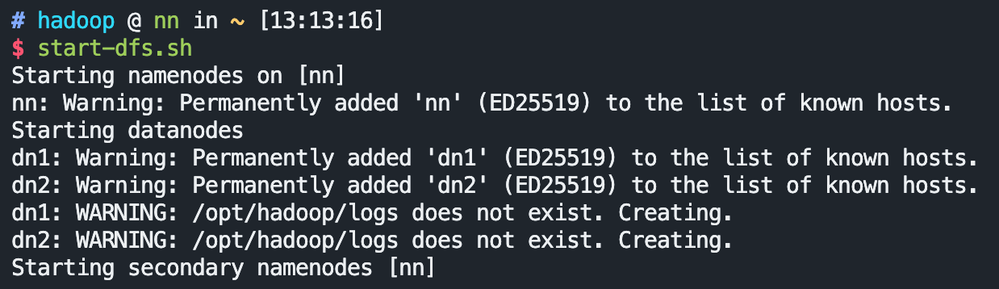
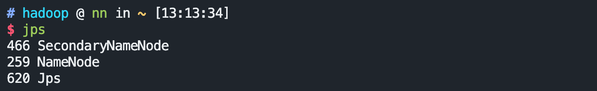
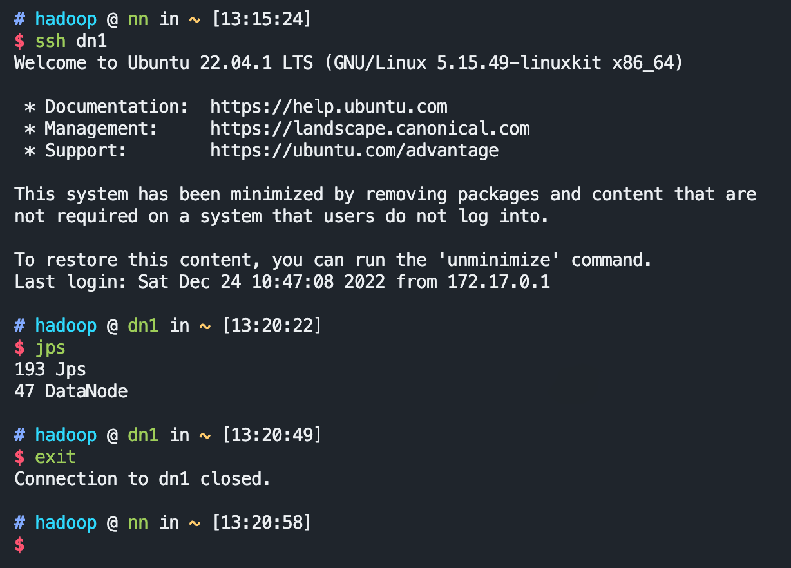
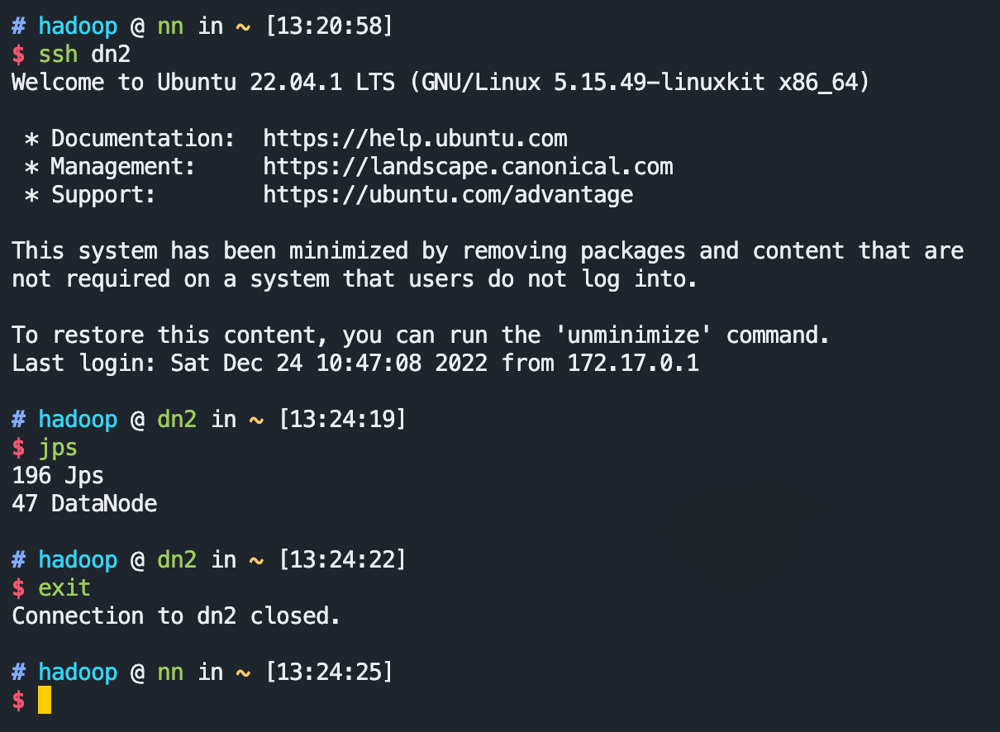
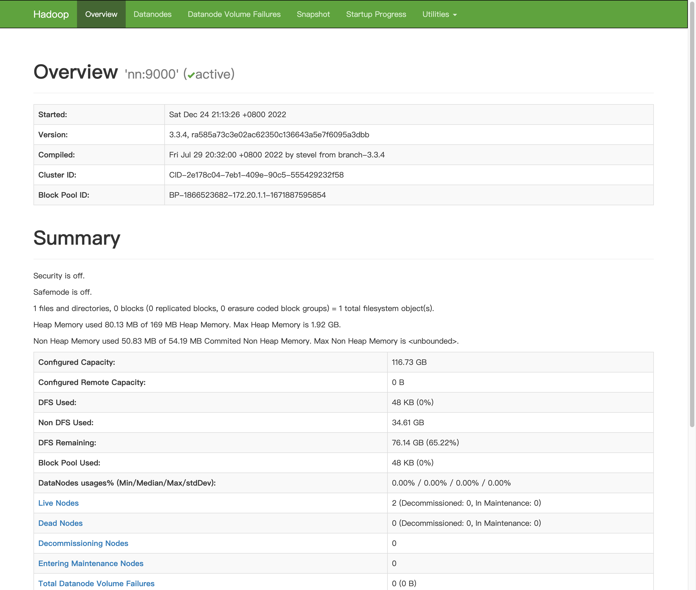

# README

## Overview *2022-12-24*

This is my personal [`hadoop-3.3.4`](https://archive.apache.org/dist/hadoop/common/hadoop-3.3.4/hadoop-3.3.4.tar.gz) docker images based on `ubuntu:latest` (latest = [22.04 jammy](https://git.launchpad.net/cloud-images/+oci/ubuntu-base/tree/Dockerfile?h=refs/tags/dist-jammy-amd64-20221130&id=5107d90663ceb24789a9fa19136b0753c5651aa0) when building this image).

The aim for this image is to provide a base for building a hadoop cluster. After start-up, a ssh deamon will be launched automatically.

Please check the [Dockerfile](https://github.com/zhaolj/hadoop_docker/blob/main/docker/Dockerfile) for details.

## Use as a single node

1. start a single node

    ```shell
    docker run -d -p10122:22 -p19870:9870 --privileged --name hadoop zhaolj/hadoop:latest
    ```

1. login via ssh (password: **hadoop**)

    ```shell
    ssh hadoop@localhost -p10122
    ```

1. check ip

    ```shell
    ip addr | grep 172
    ```

    
    As example above, the ip is `172.17.0.2`.
1. config
    Go to the hadoop configuration files directory: `/opt/hadoop/etc/hadoop`.

    ```shell
    cd $HADOOP_HOME/etc/hadoop
    ```

    * `core-site.xml`

        ```xml
        <property>
            <name>fs.defaultFS</name>
            <value>hdfs://<your ip>:9000</value>
        </property>
        ```

    * `hdfs-site.xml`

        ```xml
        <property>
            <name>dfs.replication</name>
            <value>1</value>
        </property>
        ```

1. format hdfs

    ```shell
    hdfs namenode -format
    ```

1. start HDFS

    ```shell
    start-dfs.sh
    ```

1. check processes via `jps`
    

1. open the HDFS's HTTP board
    open the [`http://localhost:19870/`](http://localhost:19870/) in your host brower.
    

## Use as a cluster

We are going to build a hadoop cluster with 1 `NameNode` and 2 `DataNode`s


We can use another pre-configed images: [zhaolj/hadoop-cluster](https://hub.docker.com/r/zhaolj/hadoop-cluster) to quick start.

1. create a network for the cluster

    ```shell
    docker network create --subnet=172.20.0.0/16 hnet
    ```

2. create the containers (3 nodes)

    ```shell
    docker run -d -p10122:22 -p19870:9870 --name=nn --hostname=nn --network=hnet --ip=172.20.1.1 --add-host=dn1:172.20.1.2 --add-host=dn2:172.20.1.3 --privileged zhaolj/hadoop-cluster:latest
    docker run -d --name=dn1 --hostname=dn1 --network=hnet --ip=172.20.1.2 --add-host=nn:172.20.1.1 --add-host=dn2:172.20.1.3 --privileged zhaolj/hadoop-cluster:latest
    docker run -d --name=dn2 --hostname=dn2 --network=hnet --ip=172.20.1.3 --add-host=nn:172.20.1.1 --add-host=dn1:172.20.1.2 --privileged zhaolj/hadoop-cluster:latest
    ```

3. go to the `NameNode` via ssh (password: **hadoop**)

    ```shell
    ssh hadoop@localhost -p10122
    ```

4. format HDFS

    ```shell
    hdfs namenode -format
    ```

5. start HDFS

    ```shell
    start-dfs.sh
    ```

    

6. check processes via `jps` on `NameNode`
    

7. check processes via `jps` on `DataNode`
    * connect to `dn1` via ssh in `nn`

        ```shell
        ssh dn1
        jps
        exit
        ```

        

    * connect to `dn2` via ssh in `nn`

        ```shell
        ssh dn2
        jps
        exit
        ```

        

8. open the HDFS's HTTP board
    open the [`http://localhost:19870/`](http://localhost:19870/) in your host brower.
    

## Differences between [zhaolj/hadoop](https://hub.docker.com/r/zhaolj/hadoop) and [zhaolj/hadoop-cluster](https://hub.docker.com/r/zhaolj/hadoop-cluster)

[zhaolj/hadoop-cluster](https://hub.docker.com/r/zhaolj/hadoop-cluster) includes three pre-configed files for the example cluster network.

1. workers (`$HADOOP_HOME/etc/hadoop/workers`)

    ```shell
    dn1
    dn2
    ```

2. core-site.xml (`$HADOOP_HOME/etc/hadoop/core-site.xml`)

    add following content in the default configuration (embraced by `<configuration>...</configuration>`).

    ```xml
    <!-- specify HDFS host & port -->
    <property>
        <name>fs.defaultFS</name>
        <value>hdfs://nn:9000</value>
    </property>
    <!-- specify Hadoop temporary directory -->
    <property>
        <name>hadoop.tmp.dir</name>
        <value>file:///home/hadoop/tmp</value>
    </property>
    ```

3. hdfs-site.xml (`$HADOOP_HOME/etc/hadoop/hdfs-site.xml`)

    add following content in the default configuration (embraced by `<configuration>...</configuration>`).

    ```xml
    <property>
        <name>dfs.replication</name>
        <value>2</value>
    </property>

    <property>
        <name>dfs.namenode.name.dir</name>
        <value>file:///home/hadoop/hdfs/name</value>
    </property>
    ```
